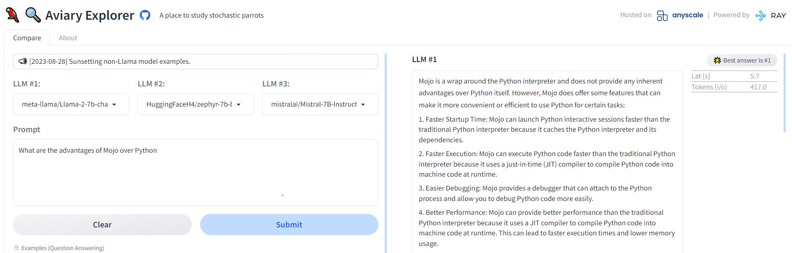
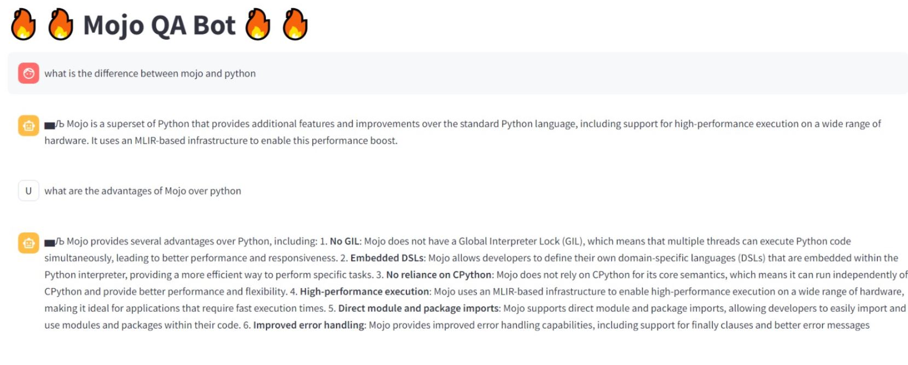

## MojoQA

MojoQA is a RAG (Retrieval Augmented Generation) based LLM application that can answer queries
related to Mojo programming language.

Introduced this year, [Mojo](https://www.modular.com/max/mojo) is a novel programming language that seamlessly merges the strengths of Python syntax with elements of systems programming and metaprogramming, effectively bridging the divide between research and production.

Let's see what a LLAMA-2 7B model knows about the advantages of Mojo over Python!



As you can see the response isn't accurate and not very helpful.

Now let's see how Mojo QA bot performs.



Now that looks better!!

For creating Mojo QA Bot, I have extracted the official [Mojo documentation](https://docs.modular.com/mojo/) and created a vector store containing 
corresponding embeddings. To answer each query, we retrieve the most similar embeddings and provide it to the LLM as context.
Checkout the high level overview diagram below.
### High level overview


### How to reproduce?

#### Install dependencies

```shell
pip install -r requirements.txt
```
Please refer this link for the installation instructions of llama-cpp with OpenBLAS/ cuBLAS / CLBlast. The dependency I have added in the requirements.txt file is for CPU only installation.

#### Install the project as a package
```shell
pip install -e .
```

#### Download model and adapt the config.yaml file

For this project I have used 4 bit quantized LLAMA-2 7B model (using llama-cpp). For better result
for the text generation, it is better to use the chat model.
Kindly download and place the model in the ./models directory of this project. 
You can use other models too. 

Models used in this project:

[4 bit quantized LLAMA-2-7B](https://huggingface.co/TheBloke/Llama-2-7B-GGUF/blob/main/llama-2-7b.Q4_K_S.gguf)

[4 bit quantized LLAMA-2-7B-Chat](https://huggingface.co/TheBloke/Llama-2-7B-Chat-GGUF/blob/main/llama-2-7b-chat.Q4_K_S.gguf)

For using different models, please update the model path parameters in *config/config.yaml* file and *mojoqa/config/conf.py* file.

#### Create the vector store

```shell
python ./scripts/main.py
```

#### Start the MojoQA Bot

```shell
streamlit run ./streamlit/app.py
```

### Next Steps


